# 📊 Diagrama ER Unificado - Star Schema
## Pipeline ETL Completo: Educação + Laboral + AIMA

**Data de Criação:** 15/12/2025  
**Versão:** 1.0  
**Arquivo:** `diagrama-er-unificado-star-schema.mermaid`

---

## 🎯 Visão Geral

Este diagrama representa o **modelo de dados unificado** que integra três domínios principais de análise sobre população estrangeira em Portugal:

1. **Educação** (DP-01-A)
2. **Laboral** (DP-01-B)  
3. **Integração AIMA** (DP-02-A)

### Características do Modelo

- **Arquitetura:** Star Schema / Snowflake Schema
- **Normalização:** 3FN/BCNF
- **Total de Entidades:** 44 tabelas
  - **19 Dimensões** (prefixo `Dim_`)
  - **25 Fatos** (prefixo `Fact_`)
- **Fonte de Dados:** INE Censos 2011 + Relatórios AIMA
- **Compatibilidade:** PostgreSQL, MySQL, SQL Server, Oracle

---

## 📋 Estrutura do Modelo

### 🔷 Dimensões (19 tabelas)

Dimensões são tabelas descritivas que fornecem contexto para os fatos. Contêm atributos qualitativos.

#### **Base (Compartilhadas)** - 5 dimensões
1. `Dim_PopulacaoResidente` - Anos de referência populacional
2. `Dim_Nacionalidade` - Cadastro de nacionalidades (12 países)
3. `Dim_Localidade` - Divisões administrativas (NUTS I/II/III, Municípios)
4. `Dim_Sexo` - Classificação por gênero
5. `Dim_GrupoEtario` - Faixas etárias

#### **Educação** - 2 dimensões
6. `Dim_NivelEducacao` - Níveis educacionais (4 níveis)
7. `Dim_MapeamentoNacionalidades` - Mapeamento entre bases de dados

#### **Laboral** - 7 dimensões
8. `Dim_CondicaoEconomica` - Condições econômicas (Ativa/Inativa)
9. `Dim_GrupoProfissional` - Grupos profissionais (Grande Grupo)
10. `Dim_ProfissaoDigito1` - Profissões (Classificação Dígito 1)
11. `Dim_SetorEconomico` - Setores CAE Rev.3 (22 setores A-U)
12. `Dim_SituacaoProfissional` - Situações profissionais
13. `Dim_FonteRendimento` - Fontes de rendimento
14. `Dim_RegiaoNUTS` - Regiões NUTS

#### **AIMA** - 5 dimensões
15. `Dim_AnoRelatorio` - Anos de relatórios (2011, 2001, etc.)
16. `Dim_TipoRelatorio` - Tipos de relatórios
17. `Dim_Despacho` - Códigos de despacho
18. `Dim_MotivoConcessao` - Motivos de concessão de residência
19. `Dim_NacionalidadeAIMA` - Nacionalidades AIMA (mapeamento)

---

### 🔶 Fatos (25 tabelas)

Fatos são tabelas que armazenam métricas, medidas e eventos. Contêm chaves estrangeiras para dimensões e valores quantitativos.

#### **Base (Compartilhados)** - 8 fatos
1. `Fact_PopulacaoPorNacionalidade` - População total por nacionalidade
2. `Fact_PopulacaoPorNacionalidadeSexo` - População por nacionalidade e sexo
3. `Fact_PopulacaoPorLocalidade` - População por localidade
4. `Fact_PopulacaoPorLocalidadeNacionalidade` - População por localidade e nacionalidade
5. `Fact_PopulacaoPorGrupoEtario` - População por grupo etário
6. `Fact_EvolucaoTemporal` - Evolução temporal 2001-2011
7. `Fact_NacionalidadePrincipal` - Ranking de nacionalidades
8. `Fact_DistribuicaoGeografica` - Distribuição geográfica

#### **Educação** - 2 fatos
9. `Fact_PopulacaoEducacao` - População por nível educacional
10. `Fact_EstatisticasEducacao` - Estatísticas educacionais consolidadas

#### **Laboral** - 8 fatos
11. `Fact_PopulacaoPorCondicao` - População por condição econômica
12. `Fact_EmpregadosPorProfissao` - Empregados por profissão
13. `Fact_EmpregadosPorSetor` - Empregados por setor econômico
14. `Fact_EmpregadosPorSituacao` - Empregados por situação profissional
15. `Fact_EmpregadosProfSexo` - Empregados por profissão e sexo
16. `Fact_EmpregadosRegiaoSetor` - Empregados por região e setor
17. `Fact_PopulacaoTrabalhoEscolaridade` - População trabalho vs. escolaridade
18. `Fact_PopulacaoRendimentoRegiao` - População por rendimento e região

#### **AIMA** - 7 fatos
19. `Fact_ConcessoesPorNacionalidadeSexo` - Concessões por nacionalidade e sexo
20. `Fact_ConcessoesPorDespacho` - Concessões por despacho
21. `Fact_ConcessoesPorMotivoNacionalidade` - Concessões por motivo
22. `Fact_PopulacaoEstrangeiraPorNacionalidadeSexo` - População estrangeira
23. `Fact_DistribuicaoEtariaConcessoes` - Distribuição etária de concessões
24. `Fact_EvolucaoPopulacaoEstrangeira` - Evolução populacional
25. `Fact_PopulacaoResidenteEtaria` - População residente por idade

---

## 🔗 Relacionamentos Principais

### Estrela Central: `Dim_Nacionalidade`

A dimensão `Dim_Nacionalidade` é a **chave de integração** do modelo, conectando:

- 8 fatos populacionais base
- 2 fatos educacionais
- 4 fatos laborais
- 1 dimensão AIMA (`Dim_NacionalidadeAIMA`)

**Cardinalidade:** 1:N (Uma nacionalidade → Múltiplos registros em fatos)

### Relacionamentos Cross-Domínio

#### Educação ↔ Laboral
- `Dim_NivelEducacao` → `Fact_PopulacaoTrabalhoEscolaridade`
- Permite análise: Nível educacional vs. Situação laboral

#### Laboral ↔ AIMA
- `Dim_MotivoConcessao` → `Dim_CondicaoEconomica` (N:M)
- `Dim_MotivoConcessao` → `Dim_SetorEconomico` (N:M)
- Permite análise: Motivo de residência vs. Setor de emprego


#### Visualização do Modelo

Disponivel também no link: [Mermaid](https://mermaid.live/view#pako:eNrVW0tv4zYQ_iuGgL0li3XeMdCDN3bSYGM7sL2XIoDASLRNrCVqKSlIm-TUQ0899hflj5XU-8GhKCk9NJdszOHHec9w6H0xLGpjY2RgNiFoy5Dz4A74z6dPg196_GQgk9vxzXI8Gw-my8H3-e317dV4shgcDlbr8XKwuvp1Oht_0IGFI2fT-er9n-lq8HW8msafT4hj3lMv3CML0SX2iY3dAA9e4lXxQ9xg4KUUJrEH99_KiwEN0N7MSMqLyKUmwxvMsGsRFK-9xb9yBubIItRFe2Iju3a2W1ysnv-EmLVDbOBSB5slyjoNNyjZUtNDxJctugFxhewAj3fUAhjcZytK7nIyCQF5wnsT2Q5xiR8wFJAnCgrA8Jakaq6xucLPtMqgzz-DWAuIR01BAODdsNCj0wAxUoPdiiUcLUHoG0SekRnRoPqqjX2LEasgS-ar1-P1ouim18gKcj-9p0zpMrm7pi4h89uaY11_U3g9vBj5f3nRQb4V7olbCYYNFgYufmpjizhoP_Aws7jzoS12inglc6h1IDO8RA8yX9BSRrqxo5IAjeQEerqRwMjIymBqLcKBnTMXxa5MbeXY_zgHyhc9yoJwG2IfQRRYZAx3iwmrkCAPBYwz57dTg2ZoxTpRBZhEf9fdYzAl1RFGkbVyQEX-ajReZW8PsSIktTcDJDG4g21pXY10Mn2i-5CfssYO9yO-p6IMnKx_fHoUdZ-HIIcAN0lWn0ShEIvo0eecBagudUaSaCgshk5KFCBedizG6wtxOA2YB0qufs8I71G8upbKmvBSso5K80XFM3nE_iDuFlLO0ZejIbw2HKodJtURJPZENBnkMRSc3GDKu9sN_2dVbLtAZW4xbZ__OkR3nCrq4vH-TIjHImKG96JFkrUUVCT-uEcqJYuss5hOvl-N3_96_3NR6D9F-zW1eSRw9Jr1o94MJ6vqBlSQSvo2FOAtLbVAApgym9tqRzBD7KfQMtCCzZCHUeTGJXf11W6qx7B0i9qIJn7mjhHdEq6_yZpUh5cd8kiKva4iW0NqL9Q3QBItD6tbT7sOq5tY6HIjiclQ1MncNSRp2g-4yvyA-4AP6QPnND2zdXxfkxvb5x4pX8Guzxsq8xHx_CVf8rEVurYoifLlkKuDUKZUk_x8CWEbUIB1BapEkqzqujax0lgp5JiGC2-Wf-7GXxfL8V0e3ldUIPJA4CmOZ696HrYSAmUkp0SN2Ud-w7tndEN8P5JHes_jZY9uIA6SiymvIy53vkq7At_2ynwkLCA6IVsS0GEtIQgG7HitgZGEqj0PKxxQlhpCco_mqw1HWwg3HltcQlteqpANMkS4X4qeVmEfP6FR-kdKBJxzTXk-X2LuQ1GhqR6xEctK_IgCAF9GA4v59_WqVrLCwG9QqCABziwOQtQNifq2kEYgXIJEdLW-IzSm5GJgV9d-hsgNKtOiesICC4rjxW7lc_GywKqVFMeThrUW8-Ws0MR-A4tR3MnYk4ac5rwi2dmXtSRwpNwBkafHYGFzLx65CWTDn8y60MinmlB1Jz45c-aOh6Hrg8tOuN_xQug3CxGnCNAN4khXeEOSRz7QCbIEsWboEe13dOpbdI8YNBUx-d3k0eSJXspfYxcqU3ZhNh3niSBhBbaHAy_BVmpUQV4YYjvJxOf9ji3s1MY8WVnRME_WQI1v06cRUVvGLueJ3wapZNQTzSDq3CBXUodV9WtNPPiQaICuGK4DmBPse8ja1eDs5POmDicha9_izKh4XLgS12lZTXCiZWWpj0naN5ql26uwovoCi3ita3F5FeSaGbju6Yk6KPZ1xupWqjzBApheE--runbqL-puIRVeNyfHd7o4HTem3ZK0kCPmQkIu2UHIIpSkG0q40uI79mPlrDoXIfFqYS59IfJQ6Gar2CbFaFGNQfIhvubLjpj7_08dsDh_jKb0KDetbAqZDF9EG259gKQNw_sPETGdvMsMDE7hhVXbiBeEe-rzohu92lvV6VTu_sirdX6M0W3UizztbYmYzXN3jaYh-TJBbGF5z-Cnpv3PrVp-Vc26ieX0bnx1u5iPZ9N5-ckZ-GbE6-vhIX1pepAeDR6M4Wj-YHTCKjxJ9gMqvoP1Q8ruyBUY6EscndXUASZKkK2gau9irXYDr0YxxlAPA3iC6awQ6Pm2G2A2hG6nVdkYW1crypeOVqrVcdsGQeTjk-4Y8cW2x_50CKELIe-3wdgtJJxuOQkA0PfyOkBlcgjyHkV_rzxRQ5AMV3S2qUcGOggN95BWTDR1lDpgykYNtEix6nSsTBBEG4a0WKl2KVKhVMHQIyGDTUjzG3X7rN28XddrwSz9Rg8PX18lSUmAzOP0Dcqs8S7WJcnXX7e6Jfra61SXfFF6XGpfLLQAipNUGYbsQalT3ak-GQHhVZkcSoAKSb6TSMB-LR5Ad1RMGfslbD2obCrTGUE2H2kD1qeOgKBt0zcIpLxedxKzoRBAIMA1qpDxVLPkfq6kiaXyJRiij_1h1LYOoMGfVgUvjdw7aao6N-8TeKqZeD-XUOP1sWkLThs0kOXc2_l6erOMG53B1XKxWh1OFrP3v-e3i0a9yzuEOOxmGnaT1NNss3FgbHn7Y4wCFuIDw8HMQeJPIxphPRjBDjv4wRD0NmI_xGlvfI-H3N8oddJtjIbbnTHaoL3P_wo9GwU4-a9EGQmvTJi3L6EbGKPTCMEYvRjPxuhweHZ2_vnk8uT05OLL-cX5xcXxgfG7-Pzy9POXo-PTo6Pj87Pz0-H524HxR3Tq8eeTi-OTy7PhxeVweH5yPDx7-xdErR6W)

Para deixar um comentario click no link: [Comentario](https://www.mermaidchart.com/d/b3dd73d0-ce38-44a4-baa5-eacd0881cd2a)

```mermaid
erDiagram
    %% ============================================================
    %% DIAGRAMA ER UNIFICADO - STAR SCHEMA
    %% ============================================================

    %% DIMENSÕES BASE
    Dim_PopulacaoResidente {
        int populacao_id PK
        int total_populacao
        int ano_referencia
    }
    
    Dim_Nacionalidade {
        int nacionalidade_id PK
        varchar nome_nacionalidade
        varchar codigo_pais
        varchar continente
    }
    
    Dim_Localidade {
        int localidade_id PK
        varchar nome_localidade
        varchar nivel_administrativo
        varchar codigo_regiao
    }
    
    Dim_Sexo {
        int sexo_id PK
        varchar tipo_sexo
    }
    
    Dim_GrupoEtario {
        int grupoetario_id PK
        varchar faixa_etaria
        varchar descricao
    }

    %% FATOS BASE
    Fact_PopulacaoPorNacionalidade {
        int populacao_nacional_id PK
        int nacionalidade_id FK
        int populacao_id FK
        int populacao_total
        int masculino
        int feminino
        decimal percentagem_total
    }
    
    Fact_PopulacaoPorNacionalidadeSexo {
        int populacao_nacional_sexo_id PK
        int nacionalidade_id FK
        int sexo_id FK
        int populacao_id FK
        int populacao_masculino
        int populacao_feminino
        decimal percentagem_masculino
        decimal percentagem_feminino
    }
    
    Fact_PopulacaoPorLocalidade {
        int populacao_local_id PK
        int localidade_id FK
        int populacao_id FK
        int populacao_total
        int populacao_portuguesa
        int populacao_estrangeira
        int apatridas
    }
    
    Fact_PopulacaoPorLocalidadeNacionalidade {
        int populacao_local_nacional_id PK
        int populacao_local_id FK
        int nacionalidade_id FK
        int populacao_nacional
    }
    
    Fact_PopulacaoPorGrupoEtario {
        int populacao_grupoetario_id PK
        int populacao_id FK
        int grupoetario_id FK
        int nacionalidade_id FK
        int populacao_grupo
        decimal percentagem_grupo
        decimal idade_media
    }
    
    Fact_EvolucaoTemporal {
        int evolucao_id PK
        int nacionalidade_id FK
        int populacao_id FK
        int ano_inicio
        int populacao_inicio
        int variacao_absoluta
        decimal variacao_percentual
        decimal taxa_crescimento
    }
    
    Fact_NacionalidadePrincipal {
        int nacionalidade_principal_id PK
        int nacionalidade_id FK
        int posicao_ranking
        int populacao_2021
        int populacao_2011
        decimal percentagem_variacao
    }
    
    Fact_DistribuicaoGeografica {
        int distribuicao_geo_id PK
        int localidade_id FK
        int nacionalidade_id FK
        int populacao_nacional_local
        decimal concentracao_relativa
        varchar dominio_regional
    }

    %% EDUCAÇÃO
    Dim_NivelEducacao {
        int nivel_educacao_id PK
        varchar nome_nivel
        varchar categoria
        int ordem_hierarquica
    }
    
    Dim_MapeamentoNacionalidades {
        int nacionalidade_educacao_id PK
        varchar nome_nacionalidade_educacao
        int nacionalidade_id_existente FK
        varchar compatibilidade
    }
    
    Fact_PopulacaoEducacao {
        int populacao_educacao_id PK
        int nacionalidade_id FK
        int nivel_educacao_id FK
        int populacao_total
        varchar faixa_etaria
        int ano_referencia
        decimal percentual_nivel
    }
    
    Fact_EstatisticasEducacao {
        int estatistica_id PK
        int nacionalidade_id FK
        int populacao_total_educacao
        int sem_educacao
        int ensino_basico
        int ensino_secundario
        int ensino_superior
        decimal percentual_sem_educacao
        decimal percentual_ensino_superior
        decimal percentual_ensino_basico
        decimal percentual_ensino_secundario
        decimal indice_educacional
        int ano_referencia
    }

    %% LABORAL
    Dim_CondicaoEconomica {
        int condicao_id PK
        varchar nome_condicao
        varchar categoria
    }
    
    Dim_GrupoProfissional {
        int grupo_prof_id PK
        varchar codigo_grande_grupo
        varchar descricao
    }
    
    Dim_ProfissaoDigito1 {
        int prof_digito1_id PK
        varchar codigo_digito1
        varchar descricao
    }
    
    Dim_SetorEconomico {
        int setor_id PK
        varchar codigo_cae
        varchar descricao
        varchar agregado
    }
    
    Dim_SituacaoProfissional {
        int situacao_id PK
        varchar nome_situacao
    }
    
    Dim_FonteRendimento {
        int fonte_id PK
        varchar nome_fonte
    }
    
    Dim_RegiaoNUTS {
        int nuts_id PK
        varchar codigo_nuts
        varchar nome_regiao
        int localidade_id FK
    }
    
    Fact_PopulacaoPorCondicao {
        int populacao_cond_id PK
        int populacao_id FK
        int nacionalidade_id FK
        int condicao_id FK
        int quantidade
        decimal percentual
    }
    
    Fact_EmpregadosPorProfissao {
        int emp_prof_id PK
        int nacionalidade_id FK
        int grupo_prof_id FK
        int quantidade
    }
    
    Fact_EmpregadosPorSetor {
        int emp_setor_id PK
        int nacionalidade_id FK
        int setor_id FK
        int quantidade
    }
    
    Fact_EmpregadosPorSituacao {
        int emp_situacao_id PK
        int nacionalidade_id FK
        int situacao_id FK
        int quantidade
    }
    
    Fact_EmpregadosProfSexo {
        int emp_prof_sexo_id PK
        int prof_digito1_id FK
        int sexo_id FK
        int quantidade_homens
        int quantidade_mulheres
    }
    
    Fact_EmpregadosRegiaoSetor {
        int emp_regiao_setor_id PK
        int nuts_id FK
        int setor_id FK
        int quantidade
    }
    
    Fact_PopulacaoTrabalhoEscolaridade {
        int pop_trab_esc_id PK
        int nivel_educacao_id FK
        int sexo_id FK
        varchar condicao_trabalho
        int quantidade_hm
        int quantidade_h
        int quantidade_m
    }
    
    Fact_PopulacaoRendimentoRegiao {
        int pop_rend_reg_id PK
        int nuts_id FK
        int fonte_id FK
        int quantidade
    }

    %% AIMA
    Dim_AnoRelatorio {
        int ano_id PK
        int ano
        varchar fonte
    }
    
    Dim_TipoRelatorio {
        int tipo_id PK
        varchar tipo
    }
    
    Dim_Despacho {
        int despacho_id PK
        varchar codigo_despacho
        varchar descricao
    }
    
    Dim_MotivoConcessao {
        int motivo_id PK
        varchar nome_motivo
        varchar categoria
    }
    
    Dim_NacionalidadeAIMA {
        int nacionalidade_aima_id PK
        varchar nome_nacionalidade_aima
        int nacionalidade_id FK
    }
    
    Fact_ConcessoesPorNacionalidadeSexo {
        int concessao_nac_sexo_id PK
        int ano_id FK
        int tipo_id FK
        int nacionalidade_aima_id FK
        int sexo_id FK
        int total_homens_mulheres
    }
    
    Fact_ConcessoesPorDespacho {
        int concessao_despacho_id PK
        int ano_id FK
        int tipo_id FK
        int despacho_id FK
        int concessoes
    }
    
    Fact_ConcessoesPorMotivoNacionalidade {
        int concessao_motivo_nac_id PK
        int ano_id FK
        int motivo_id FK
        int nacionalidade_aima_id FK
        int total_motivo
    }
    
    Fact_PopulacaoEstrangeiraPorNacionalidadeSexo {
        int pop_est_nac_sexo_id PK
        int ano_id FK
        int tipo_id FK
        int nacionalidade_aima_id FK
        int sexo_id FK
        int total_homens_mulheres
    }
    
    Fact_DistribuicaoEtariaConcessoes {
        int dist_etaria_conc_id PK
        int ano_id FK
        int tipo_id FK
        int grupoetario_id FK
        int sexo_id FK
        int total_homens_mulheres
    }
    
    Fact_EvolucaoPopulacaoEstrangeira {
        int evolucao_pop_id PK
        int ano_id FK
        int titulos_residencia
        int concessao_ap
        int prorrogacao_vld
        int total
        decimal variacao_percent
    }
    
    Fact_PopulacaoResidenteEtaria {
        int pop_res_etaria_id PK
        int ano_id FK
        int tipo_id FK
        int grupoetario_id FK
        int total
    }

    %% RELACIONAMENTOS BASE
    Dim_PopulacaoResidente ||--o{ Fact_PopulacaoPorNacionalidade : "1:N"
    Dim_PopulacaoResidente ||--o{ Fact_PopulacaoPorLocalidade : "1:N"
    Dim_PopulacaoResidente ||--o{ Fact_PopulacaoPorGrupoEtario : "1:N"
    Dim_PopulacaoResidente ||--o{ Fact_PopulacaoPorCondicao : "1:N"
    
    Dim_Nacionalidade ||--o{ Fact_PopulacaoPorNacionalidade : "1:N"
    Dim_Nacionalidade ||--o{ Fact_PopulacaoPorNacionalidadeSexo : "1:N"
    Dim_Nacionalidade ||--o{ Fact_EvolucaoTemporal : "1:N"
    Dim_Nacionalidade ||--o{ Fact_NacionalidadePrincipal : "1:1"
    Dim_Nacionalidade ||--o{ Fact_DistribuicaoGeografica : "1:N"
    Dim_Nacionalidade ||--o{ Fact_PopulacaoPorLocalidadeNacionalidade : "1:N"
    Dim_Nacionalidade ||--o{ Fact_PopulacaoEducacao : "1:N"
    Dim_Nacionalidade ||--o{ Fact_EstatisticasEducacao : "1:1"
    Dim_Nacionalidade ||--o{ Dim_MapeamentoNacionalidades : "1:1"
    Dim_Nacionalidade ||--o{ Fact_PopulacaoPorCondicao : "1:N"
    Dim_Nacionalidade ||--o{ Fact_EmpregadosPorProfissao : "1:N"
    Dim_Nacionalidade ||--o{ Fact_EmpregadosPorSetor : "1:N"
    Dim_Nacionalidade ||--o{ Fact_EmpregadosPorSituacao : "1:N"
    Dim_Nacionalidade ||--o{ Dim_NacionalidadeAIMA : "1:N"
    
    Dim_Localidade ||--o{ Fact_PopulacaoPorLocalidade : "1:N"
    Dim_Localidade ||--o{ Fact_DistribuicaoGeografica : "1:N"
    Dim_Localidade ||--o{ Dim_RegiaoNUTS : "1:N"
    
    Dim_Sexo ||--o{ Fact_PopulacaoPorNacionalidadeSexo : "1:N"
    Dim_Sexo ||--o{ Fact_EmpregadosProfSexo : "1:N"
    Dim_Sexo ||--o{ Fact_PopulacaoTrabalhoEscolaridade : "1:N"
    Dim_Sexo ||--o{ Fact_ConcessoesPorNacionalidadeSexo : "1:N"
    Dim_Sexo ||--o{ Fact_PopulacaoEstrangeiraPorNacionalidadeSexo : "1:N"
    Dim_Sexo ||--o{ Fact_DistribuicaoEtariaConcessoes : "1:N"
    
    Dim_GrupoEtario ||--o{ Fact_PopulacaoPorGrupoEtario : "1:N"
    Dim_GrupoEtario ||--o{ Fact_DistribuicaoEtariaConcessoes : "1:N"
    Dim_GrupoEtario ||--o{ Fact_PopulacaoResidenteEtaria : "1:N"
    
    Fact_PopulacaoPorLocalidade ||--o{ Fact_PopulacaoPorLocalidadeNacionalidade : "1:N"

    %% RELACIONAMENTOS EDUCAÇÃO
    Dim_NivelEducacao ||--o{ Fact_PopulacaoEducacao : "1:N"
    Dim_NivelEducacao ||--o{ Fact_PopulacaoTrabalhoEscolaridade : "1:N"
    Dim_MapeamentoNacionalidades }o--|| Dim_Nacionalidade : "N:1"

    %% RELACIONAMENTOS LABORAL
    Dim_CondicaoEconomica ||--o{ Fact_PopulacaoPorCondicao : "1:N"
    Dim_GrupoProfissional ||--o{ Fact_EmpregadosPorProfissao : "1:N"
    Dim_ProfissaoDigito1 ||--o{ Fact_EmpregadosProfSexo : "1:N"
    Dim_SetorEconomico ||--o{ Fact_EmpregadosPorSetor : "1:N"
    Dim_SetorEconomico ||--o{ Fact_EmpregadosRegiaoSetor : "1:N"
    Dim_SituacaoProfissional ||--o{ Fact_EmpregadosPorSituacao : "1:N"
    Dim_FonteRendimento ||--o{ Fact_PopulacaoRendimentoRegiao : "1:N"
    Dim_RegiaoNUTS ||--o{ Fact_EmpregadosRegiaoSetor : "1:N"
    Dim_RegiaoNUTS ||--o{ Fact_PopulacaoRendimentoRegiao : "1:N"

    %% RELACIONAMENTOS AIMA
    Dim_AnoRelatorio ||--o{ Fact_ConcessoesPorNacionalidadeSexo : "1:N"
    Dim_AnoRelatorio ||--o{ Fact_ConcessoesPorDespacho : "1:N"
    Dim_AnoRelatorio ||--o{ Fact_ConcessoesPorMotivoNacionalidade : "1:N"
    Dim_AnoRelatorio ||--o{ Fact_PopulacaoEstrangeiraPorNacionalidadeSexo : "1:N"
    Dim_AnoRelatorio ||--o{ Fact_DistribuicaoEtariaConcessoes : "1:N"
    Dim_AnoRelatorio ||--o{ Fact_EvolucaoPopulacaoEstrangeira : "1:N"
    Dim_AnoRelatorio ||--o{ Fact_PopulacaoResidenteEtaria : "1:N"
    Dim_AnoRelatorio ||--o{ Dim_PopulacaoResidente : "N:1"
    
    Dim_TipoRelatorio ||--o{ Fact_ConcessoesPorNacionalidadeSexo : "1:N"
    Dim_TipoRelatorio ||--o{ Fact_ConcessoesPorDespacho : "1:N"
    Dim_TipoRelatorio ||--o{ Fact_PopulacaoEstrangeiraPorNacionalidadeSexo : "1:N"
    Dim_TipoRelatorio ||--o{ Fact_DistribuicaoEtariaConcessoes : "1:N"
    Dim_TipoRelatorio ||--o{ Fact_PopulacaoResidenteEtaria : "1:N"
    
    Dim_Despacho ||--o{ Fact_ConcessoesPorDespacho : "1:N"
    Dim_MotivoConcessao ||--o{ Fact_ConcessoesPorMotivoNacionalidade : "1:N"
    
    Dim_NacionalidadeAIMA ||--o{ Fact_ConcessoesPorNacionalidadeSexo : "1:N"
    Dim_NacionalidadeAIMA ||--o{ Fact_PopulacaoEstrangeiraPorNacionalidadeSexo : "1:N"
    Dim_NacionalidadeAIMA ||--o{ Fact_ConcessoesPorMotivoNacionalidade : "1:N"

    %% INTEGRAÇÃO CROSS-DOMÍNIO
    Dim_MotivoConcessao ||--o{ Dim_CondicaoEconomica : "N:M"
    Dim_MotivoConcessao ||--o{ Dim_SetorEconomico : "N:M"
```


---

## 📦 Distribuição por Domínio

### Domínio Base (Compartilhado)
**13 tabelas** - 5 Dim + 8 Fact

**Uso:** Todas as 3 fases do pipeline (Educação, Laboral, AIMA)

**Tabelas:**
- Dimensões: PopulacaoResidente, Nacionalidade, Localidade, Sexo, GrupoEtario
- Fatos: 8 tabelas de população e distribuição

### Domínio Educação (DP-01-A)
**4 tabelas** - 2 Dim + 2 Fact

**Script:** `ETL_INE_2011_EDUCACAO.py`

**Tabelas:**
- Dimensões: NivelEducacao, MapeamentoNacionalidades
- Fatos: PopulacaoEducacao, EstatisticasEducacao

### Domínio Laboral (DP-01-B)
**15 tabelas** - 7 Dim + 8 Fact

**Script:** `ETL_INE_2011_LABORAL.py`

**Tabelas:**
- Dimensões: CondicaoEconomica, GrupoProfissional, ProfissaoDigito1, SetorEconomico, SituacaoProfissional, FonteRendimento, RegiaoNUTS
- Fatos: 8 tabelas de emprego e atividade econômica

### Domínio AIMA (DP-02-A)
**12 tabelas** - 5 Dim + 7 Fact

**Script:** `ETL_INE_2011_AIMA_INTEGRADO.py`

**Tabelas:**
- Dimensões: AnoRelatorio, TipoRelatorio, Despacho, MotivoConcessao, NacionalidadeAIMA
- Fatos: 7 tabelas de concessões e evolução

---

## 🎯 Casos de Uso

### 1. Análise Educacional
**Pergunta:** Qual o nível educacional predominante por nacionalidade?

**Tabelas:**
- `Dim_Nacionalidade`
- `Dim_NivelEducacao`
- `Fact_PopulacaoEducacao`

**Query exemplo:**
```sql
SELECT 
    n.nome_nacionalidade,
    ne.nome_nivel,
    pe.populacao_total,
    pe.percentual_nivel
FROM Fact_PopulacaoEducacao pe
JOIN Dim_Nacionalidade n ON pe.nacionalidade_id = n.nacionalidade_id
JOIN Dim_NivelEducacao ne ON pe.nivel_educacao_id = ne.nivel_educacao_id
WHERE ne.nome_nivel = 'Ensino superior'
ORDER BY pe.percentual_nivel DESC;
```

### 2. Análise Laboral Setorial
**Pergunta:** Quais setores concentram mais imigrantes?

**Tabelas:**
- `Dim_Nacionalidade`
- `Dim_SetorEconomico`
- `Fact_EmpregadosPorSetor`

**Query exemplo:**
```sql
SELECT 
    se.codigo_cae,
    se.descricao,
    SUM(es.quantidade) as total_imigrantes
FROM Fact_EmpregadosPorSetor es
JOIN Dim_SetorEconomico se ON es.setor_id = se.setor_id
JOIN Dim_Nacionalidade n ON es.nacionalidade_id = n.nacionalidade_id
WHERE n.nome_nacionalidade != 'Nacionalidade portuguesa'
GROUP BY se.codigo_cae, se.descricao
ORDER BY total_imigrantes DESC
LIMIT 5;
```

### 3. Análise Temporal
**Pergunta:** Quais nacionalidades mais cresceram entre 2001 e 2011?

**Tabelas:**
- `Dim_Nacionalidade`
- `Fact_EvolucaoTemporal`

**Query exemplo:**
```sql
SELECT 
    n.nome_nacionalidade,
    et.variacao_percentual,
    et.taxa_crescimento
FROM Fact_EvolucaoTemporal et
JOIN Dim_Nacionalidade n ON et.nacionalidade_id = n.nacionalidade_id
ORDER BY et.taxa_crescimento DESC
LIMIT 10;
```

### 4. Análise Cross-Domínio (Educação + Laboral)
**Pergunta:** Distribuição de profissões por nível educacional?

**Tabelas:**
- `Dim_NivelEducacao`
- `Dim_Sexo`
- `Fact_PopulacaoTrabalhoEscolaridade`

**Query exemplo:**
```sql
SELECT 
    ne.nome_nivel,
    s.tipo_sexo,
    pte.condicao_trabalho,
    pte.quantidade_hm
FROM Fact_PopulacaoTrabalhoEscolaridade pte
JOIN Dim_NivelEducacao ne ON pte.nivel_educacao_id = ne.nivel_educacao_id
JOIN Dim_Sexo s ON pte.sexo_id = s.sexo_id
WHERE pte.condicao_trabalho = 'Empregado';
```

---

## 🔧 Implementação

### Pipeline de 3 Scripts

O modelo será implementado através de **3 scripts Python** para Google Colab:

#### **Script 1: ETL_INE_2011_EDUCACAO.py**
**Gera:** 17 tabelas (Base + Educação)

**Entrada:**
- 12 CSVs por país
- `Educação e Economia.csv`
- `Demografia e Geografia.csv`

**Saída:**
- 5 Dim Base + 2 Dim Educação = 7 dimensões
- 8 Fact Base + 2 Fact Educação = 10 fatos

#### **Script 2: ETL_INE_2011_LABORAL.py**
**Gera:** 15 tabelas (Laboral)

**Entrada:**
- 12 CSVs por país
- `Situação Laboral e Profissões.csv`
- 4 tabelas intermediárias do Script 1

**Saída:**
- 7 Dim Laboral
- 8 Fact Laboral

#### **Script 3: ETL_INE_2011_AIMA_INTEGRADO.py**
**Gera:** 12 tabelas (AIMA)

**Entrada:**
- CSVs agregados (evolução, distribuição)
- Tabelas intermediárias dos Scripts 1 e 2

**Saída:**
- 5 Dim AIMA
- 7 Fact AIMA

---

## ✅ Validações de Integridade

### Chaves Primárias (PKs)
- Todas as 44 tabelas possuem PK única
- PKs são auto-incrementais (int)
- Índices criados automaticamente

### Chaves Estrangeiras (FKs)
- **Validação completa** de integridade referencial
- Todo FK deve existir na dimensão referenciada
- Cascata de exclusão/atualização configurável

### Tipos de Dados
- **int:** IDs, quantidades, anos
- **varchar:** Textos descritivos, códigos
- **decimal:** Percentagens, taxas

---

## 📊 Metadados Estatísticos

### Granularidade dos Dados

| Domínio | Nacionalidades | Períodos | Localidades | Setores |
|---------|----------------|----------|-------------|---------|
| Base | 12 | 2 (2001, 2011) | 344 | - |
| Educação | 12 | 2 | - | - |
| Laboral | 12 | 1 (2011) | 344 | 22 |
| AIMA | Variável | 2001-2024 | - | - |

### Estimativa de Registros

| Tabela | Estimativa de Registros |
|--------|-------------------------|
| Dim_Nacionalidade | 19 |
| Dim_Localidade | 344 |
| Dim_SetorEconomico | 22 |
| Fact_PopulacaoEducacao | ~150 |
| Fact_EmpregadosPorSetor | ~400 |
| Fact_DistribuicaoGeografica | ~4.000 |

**Total estimado:** ~6.000 registros em 44 tabelas

---

## 🚀 Próximos Passos

- [x] Diagrama ER Unificado criado
- [x] Documentação completa
- [ ] Implementar `ETL_INE_2011_EDUCACAO.py`
- [ ] Implementar `ETL_INE_2011_LABORAL.py`
- [ ] Implementar `ETL_INE_2011_AIMA_INTEGRADO.py`
- [ ] Testes de integridade referencial
- [ ] Validação de queries cross-domínio
- [ ] Documentação de uso

---

## 📚 Referências

- **INE - Instituto Nacional de Estatística**: [www.ine.pt](https://www.ine.pt)
- **Censos 2011**: Dados definitivos
- **CAE Rev.3**: Classificação Portuguesa de Atividades Econômicas
- **NUTS**: Nomenclatura das Unidades Territoriais para Fins Estatísticos

---

**Última Atualização:** 15/12/2025 às 22:30  
**Versão do Diagrama:** 1.0  
**Compatibilidade:** Mermaid.js 9.0+
