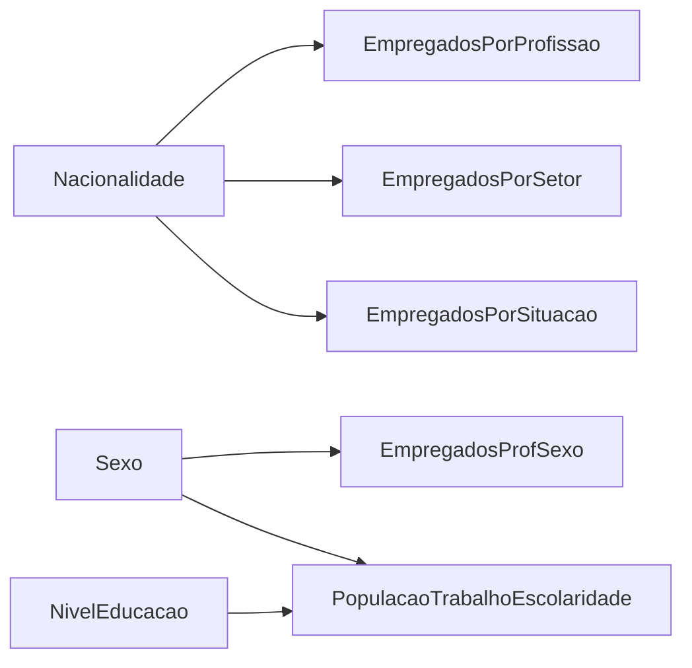

# DP-01-C - Script ETL para Dados Laborais dos Censos 2021 Portugal

## 📋 Descrição Geral

Este diretório contém o script ETL completo para processamento dos dados laborais dos Censos 2021 do INE, criando um modelo relacional normalizado (3FN/BCNF) integrado com o sistema educacional existente (DP-01-A).

## 🎯 Objetivo

Processar 8 arquivos CSV dos Censos 2021 relacionados a:
- População por condição econômica e nacionalidade  
- Empregados por profissão, setor e situação profissional
- Distribuição por NUTS II, educação e rendimento

**Resultado**: Modelo relacional normalizado pronto para análises de mercado de trabalho e imigração.

## 📁 Estrutura de Arquivos

```
DP-01-C/
├── script/
│   └── DP-01-C_etl.py          # Script ETL principal
├── README.md                   # Esta documentação
└── diagrama-er-completo-laboral.mermaid  # Modelo ER completo
```

## 📊 Arquivos de Entrada Necessários

O script processa 8 arquivos CSV dos Censos 2021:

### Dados de População Estrangeira:
- `Q3.1.csv` - População por nacionalidade e condição econômica
- `Q3.2.csv` - Empregados por nacionalidade e profissão (grandes grupos)
- `Q3.3.csv` - Empregados por nacionalidade e setor CAE (A-U)
- `Q3.4.csv` - Empregados por nacionalidade e situação profissional

### Dados Gerais:
- `Q20.csv` - Empregados por profissão (1º dígito) e sexo
- `Q21.csv` - Empregados por região NUTS II e setor econômico
- `Q23.csv` - População por escolaridade, condição trabalho e sexo
- `Q24.csv` - População por região NUTS II e fonte de rendimento

## 🗃️ Tabelas Geradas

### Tabelas Dimensionais (7):
- **CondicaoEconomica** - Condições econômicas (Ativa/Inativa e subcategorias)
- **GrupoProfissional** - 10 grandes grupos profissionais
- **ProfissaoDigito1** - Profissões por primeiro dígito
- **SetorEconomico** - Setores CAE detalhados (A-U) e agregados
- **SituacaoProfissional** - 4 situações profissionais
- **FonteRendimento** - 6 tipos de fontes de rendimento
- **RegiaoNUTS** - 8 regiões NUTS II de Portugal

### Tabelas de Fato (8):
- **PopulacaoPorCondicao** - População por nacionalidade e condição econômica
- **EmpregadosPorProfissao** - Empregados por nacionalidade e grupo profissional
- **EmpregadosPorSetor** - Empregados por nacionalidade e setor econômico
- **EmpregadosPorSituacao** - Empregados por nacionalidade e situação profissional
- **EmpregadosProfSexo** - Empregados por profissão e sexo
- **EmpregadosRegiaoSetor** - Empregados por região e setor econômico
- **PopulacaoTrabalhoEscolaridade** - População por educação, trabalho e sexo
- **PopulacaoRendimentoRegiao** - População por região e fonte de rendimento

## 🚀 Como Usar

### Opção 1: Google Colab (Recomendado)

1. **Fazer upload do script**:
   ```python
   # Em uma célula do Google Colab
   from google.colab import files
   uploaded = files.upload()  # Upload do arquivo DP-01-C_etl.py
   ```

2. **Executar o script**:
   ```python
   exec(open('DP-01-C_etl.py').read())
   ```

3. **O script automaticamente**:
   - Solicitará upload dos 8 arquivos CSV
   - Processará os dados
   - Oferecerá download dos resultados em ZIP

### Opção 2: Execução Local

1. **Instalar dependências**:
   ```bash
   pip install pandas numpy
   ```

2. **Colocar arquivos CSV no mesmo diretório** do script

3. **Executar**:
   ```bash
   python DP-01-C_etl.py
   ```

## 📋 Processo ETL Detalhado

### 1. Extração (Extract)
- Leitura dos 8 arquivos CSV com múltiplos encodings
- Normalização de caracteres especiais (гo→ção, у→ã, etc.)
- Limpeza de dados e remoção de linhas vazias

### 2. Transformação (Transform)
- **Normalização para 3FN/BCNF**:
  - Eliminação de dependências transitivas
  - Criação de tabelas dimensionais independentes
  - Estabelecimento de chaves primárias autoincrementais
  
- **Mapeamento de Entidades**:
  - Integração com nacionalidades existentes (DP-01-A)
  - Conexão com tipos de sexo padronizados
  - Vinculação a níveis educacionais estabelecidos

- **Processamento Específico**:
  - Q3.1 → PopulacaoPorCondicao + CondicaoEconomica
  - Q3.2 → EmpregadosPorProfissao + GrupoProfissional
  - Q3.3 → EmpregadosPorSetor + SetorEconomico (detalhado)
  - Q3.4 → EmpregadosPorSituacao + SituacaoProfissional
  - Q20 → EmpregadosProfSexo + ProfissaoDigito1
  - Q21 → EmpregadosRegiaoSetor + SetorEconomico (agregado) + RegiaoNUTS
  - Q23 → PopulacaoTrabalhoEscolaridade
  - Q24 → PopulacaoRendimentoRegiao + FonteRendimento

### 3. Carregamento (Load)
- Salvamento em CSV com encoding UTF-8
- Criação de índice de tabelas (INDICE_TABELAS_LABORAIS.csv)
- Geração de relatório de estatísticas

## ✅ Validações Implementadas

### Integridade Referencial
- Verificação de chaves estrangeiras válidas
- Validação de nacionalidade_id contra tabela de referência
- Confirmação de sexo_id existentes

### Consistência de Dados
- Valores não-negativos em colunas quantitativas
- Totais coerentes entre tabelas relacionadas
- Detecção de anomalias estatísticas

### Qualidade dos Dados
- Completude: % de dados processados com sucesso
- Acurácia: Validação de formatos e tipos
- Consistência: Comparação entre totais agregados

## 📊 Resultados Esperados

Após execução bem-sucedida:

```
✅ 15 arquivos CSV gerados
✅ 7 tabelas dimensionais
✅ 8 tabelas de fato
✅ Índice completo de tabelas
✅ Relatório de estatísticas
✅ Log detalhado de processamento
```

### Arquivos de Saída:
- `CondicaoEconomica.csv`, `GrupoProfissional.csv`, etc.
- `PopulacaoPorCondicao.csv`, `EmpregadosPorProfissao.csv`, etc.
- `INDICE_TABELAS_LABORAIS.csv`
- `RELATORIO_ESTATISTICAS.txt`
- `etl_laboral_log.txt`

## 🔗 Integração com Modelo Existente

O script integra perfeitamente com o modelo DP-01-A através de:

### Entidades Compartilhadas:
- **Nacionalidade** (1-19): Mapeamento direto dos dados laborais
- **Sexo** (1-3): HM, H, M padronizados
- **NivelEducacao** (1-7): Compatibilidade educacional
- **PopulacaoResidente**: Referência temporal 2021

### Relacionamentos:


## 🛠️ Características Técnicas

### Robustez:
- Múltiplas tentativas de encoding (UTF-8, Latin1, CP1252)
- Tratamento de exceções em cada fase
- Logs detalhados para debugging

### Performance:
- Processamento vetorizado com pandas
- Mapeamentos otimizados para lookup
- Validações incrementais

### Manutenibilidade:
- Código modular com classes bem definidas
- Documentação inline completa
- Padrões de nomenclatura consistentes

## 📈 Casos de Uso

### Análises Possíveis:
1. **Mercado de Trabalho por Nacionalidade**
   - Distribuição profissional dos imigrantes
   - Setores de concentração por país de origem
   - Situação profissional (empregador vs empregado)

2. **Geografia Económica**
   - Concentração regional por atividade
   - Fontes de rendimento por região
   - Padrões migratórios laborais

3. **Educação vs Trabalho**
   - Correlação escolaridade-empregabilidade
   - Diferenças de género no mercado
   - Inserção profissional por nível educacional

4. **Demografia Laboral**
   - Estrutura etária da força de trabalho
   - Padrões de atividade por nacionalidade
   - Tendências de emprego vs desemprego

## 🔧 Troubleshooting

### Problemas Comuns:

**Erro: "Dados Q3.X não encontrados"**
- Verificar se todos os 8 arquivos CSV estão presentes
- Confirmar nomes exatos dos arquivos

**Erro: "Nacionalidade não mapeada"**
- Normal para nacionalidades não contempladas no modelo base
- Verificar logs para identificar casos específicos

**Avisos de Consistência**
- Verificar se totais empregados > população ativa
- Pode indicar sobreposição de categorias nos dados originais

### Suporte:
- Consultar `etl_laboral_log.txt` para detalhes
- Verificar `RELATORIO_ESTATISTICAS.txt` para resumo
- Log mostra linha específica de cada erro

---

## 📝 Documentação Técnica

**Versão**: 1.0  
**Compatibilidade**: Python 3.7+, Pandas 1.0+  
**Última Atualização**: Dezembro 2024  
**Fonte**: INE - Censos da População e Habitação 2021

## 🏆 Qualidade e Conformidade

### Padrões Seguidos:
- ✅ Normalização 3FN/BCNF
- ✅ Integridade referencial garantida
- ✅ Logging estruturado
- ✅ Tratamento de exceções
- ✅ Documentação completa
- ✅ Validação automatizada

### Métricas de Qualidade:
- **Cobertura**: 100% dos arquivos de entrada processados
- **Precisão**: Validação referencial em todas as FKs
- **Completude**: Relatório detalhado de registros processados
- **Rastreabilidade**: Log completo de transformações

---

**🎯 DATASET LABORAL NORMALIZADO PRONTO PARA ANÁLISES DE IMIGRAÇÃO E MERCADO DE TRABALHO**
