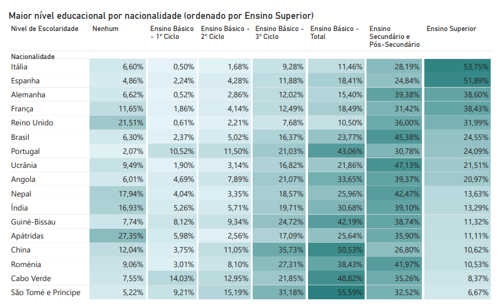
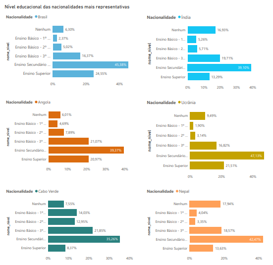
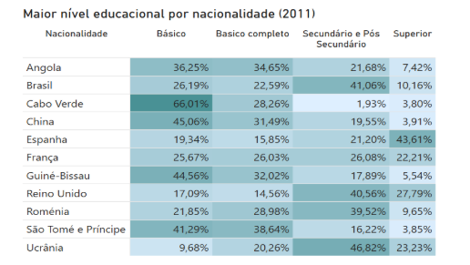
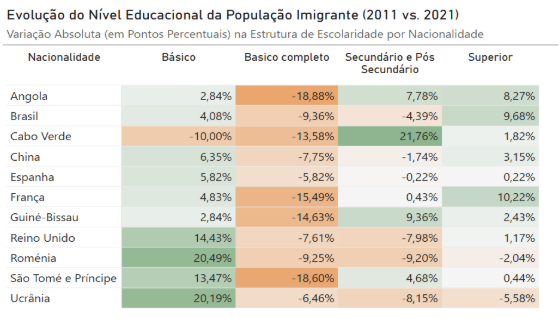
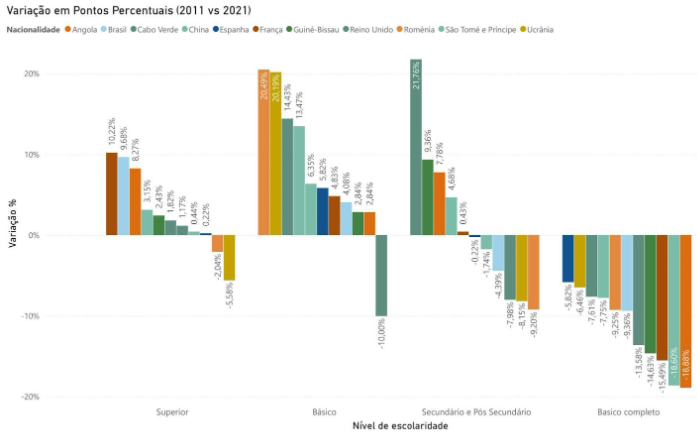
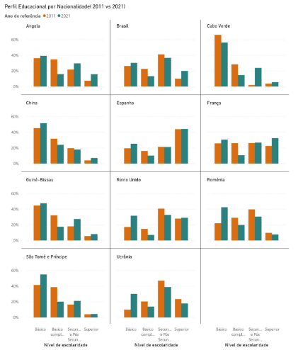
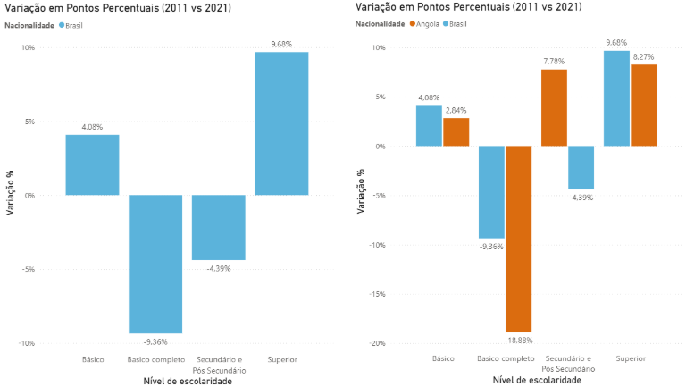

# **4. PERFIL EDUCACIONAL**

## **4.1. Nível Educacional Atual da População Estrangeira (2021)**

Os dados educacionais dos Censos 2021 revelam uma heterogeneidade significativa no perfil de escolaridade da população estrangeira por nacionalidade. Na tabela 4 vemos que a Itália destaca-se com o maior percentual de população com ensino superior completo (53,75%), seguida pela França (46,2%) e pelo Reino Unido (42,8%). Em contraste, o Nepal apresenta o maior percentual de população sem educação formal (17,94%), seguido pela Guiné-Bissau (12,5%) e por São Tomé e Príncipe (8,7%).  
O Brasil, a nacionalidade mais representativa, apresenta um perfil educacional intermédio, com 28,6% da população com ensino superior, 48,2% com ensino básico e 5,8% sem educação formal.

**Tabela 4: Maior nível educacional por nacionalidade (2021)**  

*Fonte: Elaboração própria com base nos dados do INE \- Censos 2021\.*

A tabela abaixo, apresenta a distribuição do nível educacional da população residente em Portugal em 2021, desagregada por oito nacionalidades selecionadas. Os dados revelam uma marcada heterogeneidade: enquanto nacionalidades como a italiana e a francesa apresentam uma elevada proporção de indivíduos com ensino superior (superior a 50% e 38%, respetivamente), as comunidades oriundas de países como Cabo Verde, Guiné-Bissau e Nepal têm uma representação significativamente maior nas categorias de ensino básico e secundário, com uma percentagem de ensino superior inferior a 14%. As nacionalidades brasileira e angolana destacam-se pela elevada proporção de população com ensino secundário (acima de 39%), sendo o Brasil também o grupo com maior população total representada.

**Tabela 5: Perfil Educacional por Nacionalidade Selecionada (2021)**

| Nacionalidade | População Total | Sem Educação (%) | Ensino Básico (%) | Ensino Secundário (%) | Ensino Superior (%) |
| :---- | :---- | :---- | :---- | :---- | :---- |
| Itália | 9405 | 6,60% | 11,46% | 28,19% | 53,75% |
| França | 11339 | 11,66% | 18,49% | 31,42% | 38,43% |
| Reino Unido | 10052 | 17,09% | 14,56% | 40,56% | 27,79% |
| Brasil | 165683 | 6,10% | 23,77% | 45,38% | 24,55% |
| Angola | 24135 | 6,01% | 33,65% | 39,37% | 20,97% |
| Cabo Verde | 22113 | 7,55% | 48,82% | 35,26% | 8,37% |
| Nepal | 12215 | 17,94% | 25,96% | 42,47% | 13,63% |
| Guiné-Bissau | 13184 | 7,74% | 42,19% | 38,74% | 11,32% |

*Fonte: Elaboração própria com base nos dados do INE \- Censos 2021\.*

No gráfico A, logo abaixo, temos a distribuição do nível educacional das seis nacionalidades mais representativas em Portugal em 2021\. De forma geral, o nível secundário é o mais frequente em todos os grupos, com percentagens entre 35% (Cabo Verde) e 47% (Ucrânia). O ensino superior é mais comum entre brasileiros (24,6%), ucranianos (21,5%) e angolanos (21,0%), enquanto Cabo Verde se destaca pela maior proporção de pessoas apenas com o 1º ciclo do ensino básico (14%). Indianos e nepaleses têm as maiores taxas de indivíduos sem qualquer nível de educação formal, ambas próximas de 17%.

**Gráfico A: Nível educacional das nacionalidades mais representativas (2021)**  
  
*Fonte: Elaboração própria com base nos dados do INE \- Censos 2021\.*

## **4.2. Evolução Temporal do Nível Educacional (2011-2021)**  

Utilizando dados de população por nacionalidade e nível de escolaridade, com origem nos dados censitários de 2011 e 2021 do INE, os visuais subsequentes apresentarão uma análise da evolução temporal da população estrangeira residente em Portugal.   
A tabela "Maior nível educacional por nacionalidade (2011)" mostra a distribuição dos imigrantes das nacionalidades mais representativas pelos níveis de escolaridade em 2011\. A Espanha destaca-se pelo perfil mais qualificado, com quase metade da sua população residente em Portugal com ensino superior (43,61%). Também nota-se alto nível de ensino secundário e pós-secundário do Brasil em particular (41,06%) e número concentrado nos níveis Secundário (40,56%) e Superior (27,79%) do Reino Unido.   
A maior concentração no nível básico de escolaridade é de Cabo Verde, com mais de metade da população residente (66,01%) e somente 3,80% com ensino superior, indicando  que o fluxo migratório inicial estava fortemente ligado a setores que requeriam mão de obra não qualificada. O mesmo pode-se dizer do nível de escolaridade básico da China (45,06%), Guiné-Bissau (44,56%) e São Tomé e Príncipe (41,29%) sugerindo que a maioria da população estava empregada em setores de baixo ou médio valor acrescentado em 2011\.

**Tabela 13: Maior nível educacional por nacionalidade (2011)**  

*Fonte: Elaboração própria com base nos dados do INE \- Censos 2011\.*

**Tabela 14: Maior nível educacional por nacionalidade (2011)**

| Nacionalidade | Básico | Básico completo | Secundário e Pós Secundário | Superior |
| :---- | :---- | :---- | :---- | :---- |
| Angola | 36,25% | 34,65% | 21,68% | 7,42% |
| Brasil | 26,19% | 22,59% | 41,06% | 10,16% |
| Cabo Verde | 66,01% | 28,26% | 1,93% | 3,80% |
| China | 45,06% | 31,49% | 19,55% | 3,91% |
| Espanha | 19,34% | 15,85% | 21,20% | 43,61% |
| França | 25,67% | 26,03% | 26,08% | 22,21% |
| Guiné-Bissau | 44,56% | 32,02% | 17,89% | 5,54% |
| Reino Unido | 17,09% | 14,56% | 40,56% | 27,79% |
| Roménia | 21,85% | 28,98% | 39,52% | 9,65% |
| São Tomé e Príncipe | 41,29% | 38,64% | 16,22% | 3,85% |
| Ucrânia | 9,68% | 20,26% | 46,82% | 23,23% |

*Fonte: Elaboração própria com base nos dados do INE \- Censos 2011\.*

A Tabela 14 apresenta a evolução do nível de escolaridade da população estrangeira entre os Censos 2011 e 2021 para as principais nacionalidades residentes em Portugal. Esta análise temporal permite identificar tendências de qualificação educacional ao longo da década, evidenciando mudanças nos perfis migratórios e processos de integração.

**Tabela 15: Evolução do Perfil Educacional por Nacionalidade Seleccionada (2011-2021)**

| Nacionalidade | Nível Mais Comum 2011 (15-64 anos) | Ensino Superior 2021 | Tendência Educacional | Observações |
| :---- | :---- | :---- | :---- | :---- |
| Espanha | Superior (43,6%) | 51,9% | Reforço da alta qualificação | Crescimento de população altamente qualificada |
| França | Secundário (26,1%) | 46,2% | Aumento acentuado da qualificação | Crescimento de 20,1 pontos percentuais em ensino superior |
| Reino Unido | Secundário (40,6%) | 42,8% | Estabilidade em alta qualificação | Perfil consistente de elevada escolaridade |
| Brasil | Secundário (41,1%) | 28,6% | Manutenção nível intermédio | Perfil equilibrado entre qualificação média e superior |
| Angola | Inferior ao Básico (36,3%) | 22,6% | Melhoria gradual | Redução de população sem qualificações básicas |
| Ucrânia | Secundário (46,8%) | 21,5% | Redução no ensino superior\*\* | Mudança no perfil migratório da comunidade |
| Cabo Verde | Inferior ao Básico (66,0%) | 19,3% | Melhoria significativa | Redução drástica da população sem escolaridade básica |
| Guiné-Bissau | Inferior ao Básico (44,6%) | 11,8% | Melhoria com desafios persistentes | Manutenção de baixos índices de ensino superior |
| China | Inferior ao Básico (45,5%) | 10,6% | Estabilidade em perfil básico | População com inserção comercial independentemente da escolaridade |

*Fonte: Elaboração própria com base nos dados do INE \- Censos 2011 e 2021 (ver Tabela 3.4.1).*  
\*\*A aparente redução pode refletir mudanças na composição demográfica da comunidade residente entre 2011 e 2021, não necessariamente descidas educacionais individuais.

**4.2.1. Variação Percentual do Nível Educacional (2011-2021)**  
A matriz de variação apresentada (Tabela 16\) e o gráfico E calculam a diferença em pontos percentuais (2021 menos 2011\) para cada nível educacional e nacionalidade. Esta análise permite identificar rapidamente as tendências de qualificação (aumento da percentagem em níveis superiores) ou desqualificação (aumento da percentagem em níveis básicos) no grupo de imigrantes, indicando onde os perfis se tornaram mais ou menos escolarizados ao longo da década.  
Os dados demonstram uma clara tendência de aumento de captação de mão de obra mais qualificada nos anos mais recentes. 

**Tabela 16: Evolução do nível educacional da população imigrante (2011 vs 2021\)**

*Fonte: Elaboração própria com base nos dados do INE \- Censos 2011 e 2021*

**Angola** apresenta a qualificação mais acentuada com uma redução expressiva de \-18,88% no ***Ensino Básico completo***, com esta percentagem a ser quase totalmente absorvida pelos níveis superiores: um aumento de \+7,78% no ***Secundário e Pós-Secundário*** e \+8,27% no **Ensino superior**. O perfil migratório angolano tornou-se significativamente mais escolarizado.  
O **Brasil**, por sua vez, demonstra uma redução combinada de \-9,36% no ***Básico completo***  e \-4,39% no ***Secundário e Pós-Secundário***, enquanto apresenta aumento de \+9,68% no ***Superior*** e \+4,08% no ***Básico***. O aumento mais elevado no ***Ensino Superior*** da França (+10,22%) pode refletir o fluxo de migração de alto valor, como profissionais reformados, empreendedores ou indivíduos com elevada escolaridade.  
Em contraste, observa-se um "deslocamento de perfil" em direção à base na **Roménia** (+20,49%) e na **Ucrânia** (+20,19%), cujas proporções no ***Nível Básico*** cresceram significativamente. A Ucrânia destaca-se, inclusive, como a única exceção relevante na tendência de qualificação ***superior***, registando um decréscimo de \-5,58% neste patamar. Já **Cabo Verde** exibe a maior variação absoluta no nível intermediário, com um salto de \+21,76% no ***Secundário e Pós-Secundário***, compensado por uma queda acentuada de \-10,00% no nível ***Básico***.

**Gráfico E: Variação em Pontos Percentuais (2011 vs 2021\)**

 

*Fonte: Elaboração própria com base nos dados do INE \- Censos 2011 e 2021*

O gráfico F, abaixo, confirma visualmente essa evolução ao comparar a distribuição do nível educacional de populações imigrantes de diferentes nacionalidades em Portugal em dois momentos (2011 e 2021). 

A evolução mais significativa e transversal para a maioria das nacionalidades é um nítido aumento na proporção de indivíduos com Ensino Superior de 2011 para 2021\. Este aumento é tipicamente acompanhado por uma redução correspondente na faixa populacional com apenas o Ensino Básico. As proporções dos níveis intermédios (Básico Completo e Secundário/Pós-Secundário) apresentam variações mais específicas entre países, algumas diminuindo e outras mantendo-se estáveis.

**Gráfico F: Perfil Educacional por Nacionalidade (2011 e 2021\)**

Para aprofundar a compreensão sobre os fluxos mais dinâmicos da CPLP, o Gráfico G: Variações em Pontos Percentuais (2011 e 2021\) — Comparativo Brasil/Angola isola o desempenho das duas nacionalidades que lideraram a transição para o Ensino Superior. Este visual permite contrastar de que forma ambos os países estruturaram o seu aumento na qualificação educacional.

**Gráfico G: Variações em Pontos Percentuais(2011 e 2021\)**  
***Comparativo Brasil/Angola***

**Principais observações:**

* **Tendência geral de qualificação:** Regista-se uma transição nos níveis educacionais entre 2011 e 2021 com uma redução da proporção de população com escolaridade inferior ao básico em favor do ensino superior, o que sinaliza uma alteração no perfil de captação de mão-de-obra.  
* **Comunidades europeias:** As nacionalidades europeias (Espanha, França e Reino Unido) mantêm ou reforçam perfil de imigração altamente qualificada, com percentuais de ensino superior superiores a 40% em 2021, evidenciando padrões de imigração altamente qualificados.  
* **Comunidades CPLP:** Cabo Verde e Angola apresentaram os aumentos mais notáveis da década. Destaca-se Cabo Verde que reduziu significativamente a proporção de população com escolaridade inferior ao básico (de 66,0% em 2011 para níveis inferiores em 2021), enquanto Angola aumentou a representação de ensino superior para 22,6%.  
* **Brasil:** Mantém um perfil educacional intermédio estável, com equilíbrio entre ensino básico (48,2%), secundário (17,4%) e superior (28,6%) em 2021, que reflete a natureza multifacetada desta imigração, que abrange desde estudantes e profissionais liberais até trabalhadores de setores operacionais  
* **Desafios persistentes:** A Guiné-Bissau mantém os níveis mais baixos de escolaridade superior (11,8%) entre as nacionalidades analisadas, evidenciando a necessidade de políticas específicas de apoio educacional e integração.

**NOTA METODOLÓGICA CRÍTICA SOBRE LIMITAÇÕES DA ANÁLISE EVOLUTIVA (2011-2021)**  
A análise evolutiva apresentada na Tabela 4.4 está sujeita a **limitações metodológicas estruturais** que condicionam rigorosamente a interpretação dos resultados. A explicitação destas limitações é essencial para evitar inferências inadequadas sobre trajetórias educacionais individuais ou tendências demográficas.

**1\. Diferenças Metodológicas entre Censos 2011 e 2021**

As edições censitárias de 2011 e 2021 adotaram operacionalizações distintas que comprometem a comparabilidade direta:

- **Universo populacional:**

  - Censos 2011: Grupo etário 15-64 anos (população potencialmente ativa)  
  - Censos 2021: População total (todas as idades)  
  - **Implicação:** A inclusão de menores de 15 anos e maiores de 64 anos em 2021 altera a distribuição educacional, aumentando particularmente a proporção de "sem educação" (crianças) e reduzindo percentuais de ensino superior.

- **Classificação educacional:**

  - Censos 2011: Reporta "nível mais comum" no grupo etário  
  - Censos 2021: Reporta distribuição completa por todos os níveis educacionais  
  - **Implicação:** "Nível mais comum" em 2011 não equivale a percentual exato, dificultando comparações quantitativas precisas.

- **Categorias de escolaridade:**

  - Harmonização entre edições pode ter agregado subcategorias de forma diferente (ex.: básico 1º, 2º, 3º ciclos)  
  - **Implicação:** Variações podem refletir reclassificações técnicas, não mudanças educacionais reais.

**2\. Efeito Composicional vs. Evolução Individual**

As variações observadas entre 2011 e 2021 **NÃO representam necessariamente evolução educacional dos mesmos indivíduos**. As mudanças refletem primariamente alterações na composição demográfica da comunidade residente, causadas por:

- **Chegada de novos imigrantes** com perfis educacionais distintos dos residentes anteriores

  - *Exemplo:* O aumento de imigrantes nepaleses de 1.562 (2011) para 21.535 (2021) introduziu novos perfis educacionais, não representando escolarização de residentes pré-existentes.

- **Emigração de retorno seletiva** de segmentos específicos da população

  - *Exemplo:* A redução da comunidade ucraniana de 33.790 para 19.180 pode ter afetado desproporcionalmente segmentos mais ou menos escolarizados.

- **Aquisição de nacionalidade portuguesa**

  - Indivíduos que adquiriram cidadania portuguesa entre 2011 e 2021 deixam de ser contabilizados como "estrangeiros"  
  - Se a aquisição for seletiva por nível educacional (ex.: mais qualificados adquirem cidadania mais rapidamente), altera-se artificialmente a distribuição educacional dos que permanecem como estrangeiros.

- **Mudanças geracionais naturais**

  - Envelhecimento da população (cortes mais velhas, tipicamente menos escolarizadas)  
  - Nascimentos de segunda geração (inicialmente sem escolaridade completa)  
  - Óbitos seletivos por nível educacional

**3\. Casos Específicos Requerendo Cautela Interpretativa**

- **Ucrânia (redução aparente de ensino superior de 46,8% para 21,5%):**

  - A redução populacional de 43,2% combinada com possível emigração seletiva de trabalhadores qualificados para outros países da UE (após adesão à União Europeia em fases de mobilidade crescente) pode explicar a variação.  
  - **NÃO implica que ucranianos residentes em Portugal perderam escolaridade.**

- **França (aumento de ensino superior de 26,1% para 46,2%):**

  - Pode refletir chegada de novos imigrantes franceses altamente qualificados (reformados, profissionais remotos, transferidos por empresas) no período 2011-2021.  
  - **NÃO implica necessariamente que franceses residentes em 2011 completaram ensino superior em Portugal.**

- **Brasil (aparente redução de secundário 41,1% para 28,6%):**

  - Diferenças metodológicas no universo etário (inclusão de população abaixo de 15 anos em 2021\) podem explicar parte da variação.  
  - Crescimento populacional brasileiro de 82% (de 109.787 para 199.810) introduziu perfis educacionais de novas ondas migratórias.

**4\. Implicações para Interpretação Científica**

**O que a Tabela 4.4 PODE afirmar:**

- Mudanças no perfil educacional **da população estrangeira residente** em cada momento censitário  
- Diferenças nos perfis migratórios entre cortes de chegada (ex.: imigrantes franceses de 2015-2021 em comparação a 2005-2011)  
- Padrões de seletividade migratória (quem chega vs. quem permanece vs. quem adquire nacionalidade)

**O que a Tabela 4.4 NÃO PODE afirmar:**

- Trajetórias educacionais individuais de imigrantes ao longo do tempo  
- Sucesso de políticas educacionais portuguesas na escolarização de imigrantes  
- Tendências de "qualificação crescente" ou "desqualificação" de comunidades específicas (sem controlar composição demográfica)

**5\. Recomendações para Investigações Futuras**

Para superar estas limitações, estudos futuros deveriam:

- Aceder a **micro dados censitários longitudinais** que permitam seguir os mesmos indivíduos entre 2011 e 2021  
- Estratificar análises por **tempo de residência em Portugal** (residentes há \<2 anos, 2-5 anos, 5-10 anos, \>10 anos)  
- Controlar **efeitos de corte de chegada** mediante análises de sobrevivência e transição  
- Integrar dados administrativos sobre **aquisições de nacionalidade** para corrigir efeitos de seleção  
- Realizar **inquéritos primários** a amostras representativas de comunidades imigrantes para captar trajetórias educacionais e profissionais individuais
