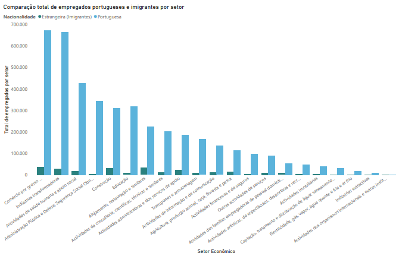
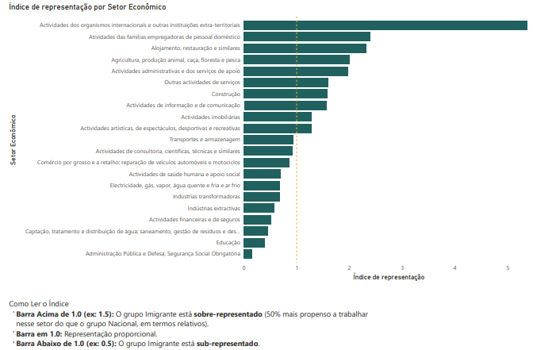
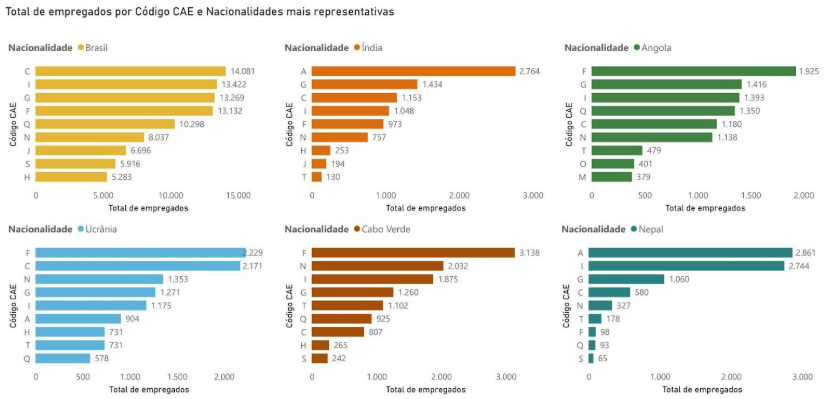

# **5. INSERÇÃO NO MERCADO DE TRABALHO**

## **5.1. Visão Geral e Comparação com a População Portuguesa**

Segundo os dados dos Censos 2021 do INE, a população estrangeira empregada totaliza 264.271 trabalhadores, representando 5,97% do total de empregados em Portugal (4.426.393 trabalhadores). A análise da distribuição setorial, segundo a Classificação das Atividades Económicas (CAE Rev.3), revela padrões diferenciados de inserção laboral entre a população portuguesa (4.162.122 empregados) e a população estrangeira.

**Gráfico B: Comparação total de empregados portugueses e imigrantes por setor (2021)**

*Fonte: Elaboração própria com base nos dados do INE \- Censos 2021\.*

A distribuição setorial da população estrangeira apresenta diferenças notáveis face à população portuguesa. Enquanto os portugueses apresentam maior concentração nos setores de Comércio (16,20%), indústrias transformadoras (15,97%) e Administração Pública (8,28%), a população estrangeira concentra-se predominantemente em Comércio (13,92%), alojamento e restauração (12,52%) e Construção (11,88%).

**Tabela 8: Principais Setores de Atividade Económica da População Estrangeira Empregada (2021)**

| Setor (CAE) | Descrição | Empregados Estrangeiros | % da Pop. Estrangeira | % do Setor | Empregados Portugueses |
| :---- | :---- | :---- | :---- | :---- | :---- |
| G | Comércio por grosso e a retalho | 36.794 | 13,92% | 5,17% | 674.229 |
| I | Alojamento, restauração e similares | 33.090 | 12,52% | 12,87% | 224.045 |
| F | Construção | 31.385 | 11,88% | 9,17% | 310.743 |
| C | Indústrias transformadoras | 28.672 | 10,85% | 4,14% | 664.636 |
| N | Atividades administrativas | 23.514 | 8,90% | 11,15% | 187.350 |
| Q | Saúde humana e apoio social | 18.908 | 7,15% | 4,24% | 426.542 |
| A | Agricultura e pesca | 14.663 | 5,55% | 11,27% | 115.478 |
| J | Informação e comunicação | 13.429 | 5,08% | 9,03% | 135.295 |
| M | Consultoria, científicas e técnicas | 11.899 | 4,50% | 5,53% | 203.241 |
| H | Transportes e armazenagem | 9.821 | 3,72% | 5,59% | 165.739 |

*Fonte: Elaboração própria com base nos dados do INE \- Censos 2021\.*

A inserção da população estrangeira no mercado de trabalho português não é uniforme, revelando uma forte segmentação setorial. Para medir esta disparidade, utiliza-se o **Índice de Representatividade (Gráfico C)**, que compara a proporção de estrangeiros em cada setor face à proporção de nacionais.

**Gráfico C: Índice de Representação por Setor Econômico (2021)**

**Análise do Índice de Representatividade (Gráfico C):**

* **Sobre-representação (\> 1.0):** Destacam-se aqui o setor atividades dos organismos internacionais e outras instituições extra-territoriais, o Alojamento e Restauração, a Construção e as Atividades das famílias empregadoras de pessoal doméstico . Um índice, por exemplo, de 2.0 significaria que os estrangeiros têm o dobro da presença proporcional nesses setores em comparação com os portugueses.  
* **Sub-representação (\< 1.0):** Índices inferiores a 1 revelam barreiras à entrada ou falta de absorção. A Administração Pública e a Educação surgem consistentemente abaixo da linha de paridade, evidenciando que estas áreas permanecem predominantemente ocupadas por nacionais, muitas vezes devido a requisitos legais de cidadania ou reconhecimento de diplomas.  
* **Ponto de Paridade (1.0):** Representa o equilíbrio perfeito onde a distribuição de estrangeiros espelha exatamente a dos nacionais. A distância das barras em relação a este eixo central ilustra visualmente a especialização laboral da imigração em Portugal.

## **5.2. Análise Setorial Detalhada**

Enquanto o Índice de Representatividade (Gráfico C) revela a desproporção e a segmentação do mercado, a Tabela 9 permite quantificar essa realidade, detalhando o volume de trabalhadores em cada um dos 22 setores da Classificação das Atividades Económicas (CAE Rev.3). Esta análise é crucial para distinguir setores que, embora tenham muitos estrangeiros em termos absolutos, podem estar em paridade com a população nacional, nos permitindo uma visão integral da estrutura do mercado de trabalho português e dos padrões de inserção da população imigrante.  

**Tabela 9: Distribuição Completa da População Empregada por Setor de Atividade Económica e Nacionalidade (2021)**

| Cód. | Setor de Atividade Económica | Estrangeiros | Portugueses | Total | % Estrangeiros no Setor | % da Pop. Estrangeira |
| :---- | :---- | :---- | :---- | :---- | :---- | :---- |
| A | Agricultura, produção animal, caça, floresta e pesca | 14.663 | 115.478 | 130.141 | 11,27% | 5,55% |
| B | Indústrias extractivas | 366 | 9.887 | 10.253 | 3,57% | 0,14% |
| C | Indústrias transformadoras | 28.672 | 664.636 | 693.308 | 4,14% | 10,85% |
| D | Electricidade, gás, vapor, água quente e fria e ar frio | 774 | 17.693 | 18.467 | 4,19% | 0,29% |
| E | Captação, tratamento e distribuição de água; saneamento, gestão de resíduos e despoluição | 923 | 31.400 | 32.323 | 2,86% | 0,35% |
| F | Construção | 31.385 | 310.743 | 342.128 | 9,17% | 11,88% |
| G | Comércio por grosso e a retalho; reparação de veículos automóveis e motociclos | 36.794 | 674.229 | 711.023 | 5,17% | 13,92% |
| H | Transportes e armazenagem | 9.821 | 165.739 | 175.560 | 5,59% | 3,72% |
| I | Alojamento, restauração e similares | 33.090 | 224.045 | 257.135 | 12,87% | 12,52% |
| J | Actividades de informação e de comunicação | 13.429 | 135.295 | 148.724 | 9,03% | 5,08% |
| K | Actividades financeiras e de seguros | 3.262 | 98.373 | 101.635 | 3,21% | 1,23% |
| L | Actividades imobiliárias | 3.165 | 38.775 | 41.940 | 7,55% | 1,20% |
| M | Actividades de consultoria, científicas, técnicas e similares | 11.899 | 203.241 | 215.140 | 5,53% | 4,50% |
| N | Actividades administrativas e dos serviços de apoio | 23.514 | 187.350 | 210.864 | 11,15% | 8,90% |
| O | Administração Pública e Defesa; Segurança Social Obrigatória | 3.585 | 344.778 | 348.363 | 1,03% | 1,36% |
| P | Educação | 8.191 | 320.063 | 328.254 | 2,50% | 3,10% |
| Q | Actividades de saúde humana e apoio social | 18.908 | 426.542 | 445.450 | 4,24% | 7,15% |
| R | Actividades artísticas, de espectáculos, desportivas e recreativas | 3.848 | 47.314 | 51.162 | 7,52% | 1,46% |
| S | Outras actividades de serviços | 9.221 | 90.646 | 99.867 | 9,23% | 3,49% |
| T | Atividades das famílias empregadoras de pessoal doméstico | 8.286 | 54.503 | 62.789 | 13,20% | 3,14% |
| U | Actividades dos organismos internacionais e outras instituições extra-territoriais | 475 | 1.392 | 1.867 | 25,44% | 0,18% |
| **TOTAL** | **Todos os Setores** | **264.271** | **4.162.122** | **4.426.393** | **5,97%** | **100,00%** |

*Fonte: Elaboração própria com base nos dados do INE \- Censos 2021\.*

Em termos de volume absoluto de trabalhadores estrangeiros empregados, os cinco principais setores são:

1. **Comércio por grosso e a retalho** (Setor G): 36.794 trabalhadores estrangeiros, representando 13,92% da população estrangeira empregada  
2. **Alojamento, restauração e similares** (Setor I): 33.090 trabalhadores estrangeiros (12,52% do total de estrangeiros)  
3. **Construção** (Setor F): 31.385 trabalhadores estrangeiros (11,88% do total de estrangeiros)  
4. **Indústrias transformadoras** (Setor C): 28.672 trabalhadores estrangeiros (10,85% do total de estrangeiros)  
5. **Atividades administrativas e dos serviços de apoio** (Setor N): 23.514 trabalhadores estrangeiros (8,90% do total de estrangeiros)

Estes cinco setores concentram conjuntamente 58,07% (153.455) da população estrangeira empregada em Portugal, evidenciando uma concentração setorial significativa.

**Gráfico D: Total de empregados por código CAE das nacionalidades mais representativas (2021)**

*Fonte: Elaboração própria com base nos dados do INE \- Censos 2021\.*

Ao cruzar o índice anterior com os dados absolutos da Tabela 9, emergem conclusões fundamentais para o perfil sócio-profissional:

* **Sobre-representação:** O índice elevado em setores como ***Alojamento e Restauração (Setor I)*** é confirmado por um volume de 33.090 trabalhadores estrangeiros que representam 12,87% de toda a força de trabalho deste setor.  
* **Maior volume de absorção:** Embora o ***Comércio (Setor G)*** tenha um índice de representatividade mais próximo da paridade (5,17%), ele é, em números absolutos, o maior empregador da imigração (36.794 pessoas). Isto demonstra que o Comércio é um setor de absorção, que emprega tanto nacionais como estrangeiros em larga escala.  
* **Sub-representação:** A sub-representação drástica na ***Administração Pública*** (1,03%) visível no gráfico é validada pela Tabela 9, onde apenas 3.585 estrangeiros estão inseridos, contra quase 345 mil portugueses.

**Setores de Maior Concentração Relativa**  
Enquanto alguns setores absorvem muitos estrangeiros em números brutos, outros destacam-se pela  elevada proporção de imigrantes face ao total de trabalhadores do próprio setor. A Tabela 10 identifica os 10 setores onde a inserção relativa é mais expressiva, revelando dependências estruturais da economia portuguesa.  

**Tabela 10: Top 10 Setores por Percentagem de Trabalhadores Estrangeiros (2021)**

| Posição | Cód. | Setor de Atividade Económica | Estrangeiros | Total Setor | % Estrangeiros | % da Pop. Estrangeira |
| :---- | :---- | :---- | :---- | :---- | :---- | :---- |
| 1º | U | Actividades dos organismos internacionais e outras instituições extra-territoriais | 475 | 1.867 | **25,44%** | 0,18% |
| 2º | T | Atividades das famílias empregadoras de pessoal doméstico | 8.286 | 62.789 | **13,20%** | 3,14% |
| 3º | I | Alojamento, restauração e similares | 33.090 | 257.135 | **12,87%** | 12,52% |
| 4º | A | Agricultura, produção animal, caça, floresta e pesca | 14.663 | 130.141 | **11,27%** | 5,55% |
| 5º | N | Actividades administrativas e dos serviços de apoio | 23.514 | 210.864 | **11,15%** | 8,90% |
| 6º | S | Outras actividades de serviços | 9.221 | 99.867 | **9,23%** | 3,49% |
| 7º | F | Construção | 31.385 | 342.128 | **9,17%** | 11,88% |
| 8º | J | Actividades de informação e de comunicação | 13.429 | 148.724 | **9,03%** | 5,08% |
| 9º | L | Actividades imobiliárias | 3.165 | 41.940 | **7,55%** | 1,20% |
| 10º | R | Actividades artísticas, de espectáculos, desportivas e recreativas | 3.848 | 51.162 | **7,52%** | 1,46% |

*Fonte: Elaboração própria com base nos dados do INE \- Censos 2021\.*

**Análise dos Dados**

**Volume absoluto vs. Relativo:** O **Setor U (Organismos Internacionais)** lidera o ranking com 25,44% de representatividade, embora tenha um peso absoluto reduzido. Já o **Alojamento e Restauração (Setor I)** e a **Construção (Setor F)** confirmam a sua relevância crítica ao aparecerem simultaneamente no topo do volume absoluto e da concentração relativa (12,87% e 9,17%, respetivamente).

**Trabalho Doméstico:** A elevada concentração em **Atividades das Famílias Empregadoras (13,20%)** reforça o papel da imigração na prestação de serviços de proximidade e apoio social.

**Informação e Comunicação:** A presença de setores como **Informação e Comunicação (9,03%)** no 8.º lugar deste ranking é um indicador claro de que Portugal está a conseguir atrair talentos para áreas tecnológicas, saindo do estigma de uma imigração puramente operacional.
