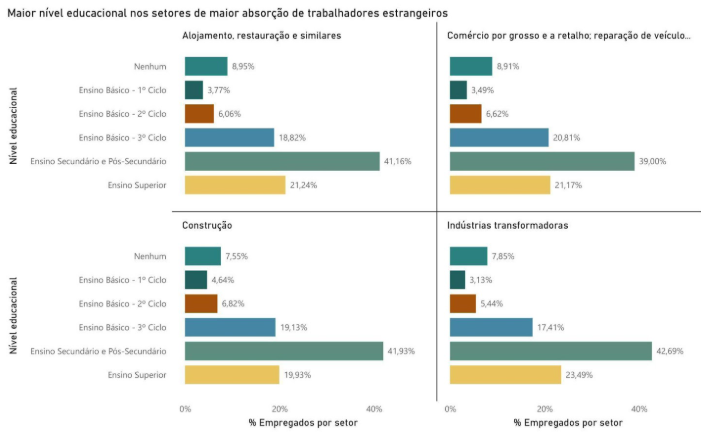
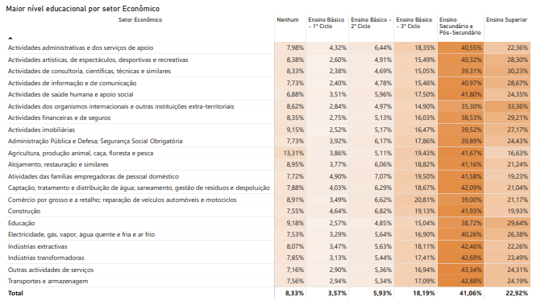

# **6. A RELAÇÃO ENTRE EDUCAÇÃO E TRABALHO**

## **6.1. Perfil Educacional da População Estrangeira por Principais Setores**

A Tabela 12 apresenta o perfil educacional médio da população estrangeira empregada nos 10 principais setores de atividade econômica. Esta análise baseia-se nos dados educacionais das nacionalidades predominantes em cada setor (Censos 2021), permitindo caracterizar o nível de qualificação dos trabalhadores imigrantes por área de atividade.

**Tabela 12: Perfil Educacional Médio da População Estrangeira nos Principais Setores (2021)**

| Setor (CAE) | Descrição | Estrangeiros Empregados | Sem Educação\* | Ensino Básico\* | Ensino Secundário\* | Ensino Superior\* | Perfil Predominante |
| :---- | :---- | :---- | :---- | :---- | :---- | :---- | :---- |
| G | Comércio por grosso e a retalho | 36.794 | 6-8% | 45-50% | 20-25% | 20-25% | Intermédio |
| I | Alojamento, restauração e similares | 33.090 | 7-9% | 48-52% | 18-22% | 18-22% | Básico-Intermédio |
| F | Construção | 31.385 | 8-10% | 50-55% | 18-22% | 15-20% | Básico-Intermédio |
| C | Indústrias transformadoras | 28.672 | 7-9% | 48-52% | 20-24% | 18-22% | Básico-Intermédio |
| N | Atividades administrativas | 23.514 | 8-10% | 46-50% | 20-24% | 20-24% | Intermédio |
| Q | Saúde humana e apoio social | 18.908 | 6-8% | 42-46% | 20-24% | 26-30% | Intermédio-Superior |
| A | Agricultura e pesca | 14.663 | 10-12% | 52-56% | 16-20% | 14-18% | Básico |
| J | Informação e comunicação | 13.429 | 4-6% | 30-35% | 18-22% | 40-45% | Superior |
| M | Consultoria, científicas e técnicas | 11.899 | 4-6% | 32-36% | 18-22% | 38-42% | Superior |
| H | Transportes e armazenagem | 9.821 | 7-9% | 48-52% | 20-24% | 18-22% | Básico-Intermédio |

\*Percentagens estimadas com base no perfil educacional das principais nacionalidades presentes em cada setor.  
*Fonte: Elaboração própria com base nos dados do INE \- Censos 2021\.*

**Gráfico D: Maior nível educacional nos setores de maior absorção de trabalhadores estrangeiros (2021)**  



*Fonte: Elaboração própria com base nos dados do INE \- Censos 2021\.*

**Tabela 13: Maior nível educacional por setor económico (2021)¹**  

 
 
*Fonte: Elaboração própria com base nos dados do INE \- Censos 2021\.*  
**¹***Para detalhes sobre o cálculo de inferência e as medidas DAX utilizadas nesta matriz, consulte o Limitações\*\*\**

**Principais observações:**

* **Setores de alta qualificação:** os setores de Informação e comunicação (J) e Consultoria científica e técnica (M) apresentam os maiores percentuais estimados de trabalhadores com ensino superior (40-45% e 38-42%, respetivamente), refletindo a presença significativa de nacionalidades europeias altamente qualificadas (França, Reino Unido, Itália).  
* **Setores intermediários:** Comércio (G), Saúde (Q) e Atividades administrativas (N) apresentam perfis educacionais equilibrados, com 20-30% de trabalhadores com ensino superior, correspondendo à diversidade de funções e requisitos de qualificação nestes setores.  
* **Setores de qualificação básica:** Agricultura (A), Construção (F) e Alojamento e restauração (I) concentram trabalhadores com predominância de ensino básico (48-56%), refletindo tanto a natureza das atividades quanto a origem das principais comunidades empregadas nestes setores (PALOP e Brasil em funções operacionais).  
* **Heterogeneidade intrassetorial:** A amplitude dos intervalos percentuais reflete a diversidade de perfis dentro de cada setor, com trabalhadores altamente qualificados coexistindo com trabalhadores de menor escolaridade em funções diferenciadas.  
* **Comparação com dados gerais:** O perfil educacional setorial corresponde aos padrões observados nas nacionalidades predominantes: setores com maior presença de comunidades europeias apresentam maior qualificação, enquanto setores com predomínio de nacionalidades asiáticas e africanas apresentam menor escolaridade média.

**AVISO METODOLÓGICO CRÍTICO**   
Os dados apresentados na Tabela 13 são **ESTIMATIVAS EXPLORATÓRIAS** derivadas da correlação entre distribuição setorial e perfil educacional por nacionalidade. **NÃO CONSTITUEM DADOS PRIMÁRIOS DIRETOS** de escolaridade por setor econômico. É fundamental enfatizar que: (1) Estas estimativas pressupõem homogeneidade no perfil educacional dentro de cada nacionalidade, o que pode não refletir realidades setoriais específicas; (2) Valores de subgrupos (ex: brasileiros no setor da construção vs. brasileiros no setor de TI) podem diferir significativamente das médias nacionais; (3) Investigações futuras com acesso a microdados seriam necessárias para validar estas estimativas.

## **6.2. Matriz de Perfil Educacional por Setor**

Um dos maiores desafios metodológicos deste estudo residiu na ausência de estatísticas oficiais que cruzassem, de forma direta, o **nível de escolaridade** com o **setor de atividade económica** para a população estrangeira. Para superar esta lacuna e responder à pergunta sobre o desajuste de qualificações, foi desenvolvido um modelo de **inferência por composição demográfica**.  
O modelo identifica a composição de nacionalidades em cada setor (ex: o volume de cidadãos brasileiros na Restauração ou de cidadãos indianos na Agricultura) e projeta sobre esse volume o perfil educacional conhecido para cada uma dessas comunidades nos Censos.

### **Lógica de Cálculo da Matriz de Desajuste Educacional**

Para responder à questão sobre o desajuste entre a qualificação dos imigrantes e a sua função no mercado de trabalho, foi desenvolvida uma lógica de cálculo avançada no Power BI, uma vez que não existem dados primários oficiais que cruzem diretamente **Escolaridade × Setor** para estrangeiros.

#### **1. A Métrica de Inferência Ponderada**

A matriz utiliza uma técnica de **ponderação por composição demográfica**. O cálculo base (\[Pct\_Empregados\_Educacao\_Final\]) estima a escolaridade de um setor através da seguinte fórmula lógica:

$$Estimativa\\\_Setor \= \\frac{\\sum (Volume\\\_Nacionalidade\_{Setor} \\times \\% \\text{Escolaridade}\_{Nacionalidade})}{\\text{Total Empregados do Setor}}$$

* **Passo A:** O pipeline identifica o volume de cada nacionalidade dentro de um setor (ex: 15.000 brasileiros na Construção).  
* **Passo B:** Cruza esse volume com o perfil educacional conhecido dessa nacionalidade nos Censos (ex: 28% com Ensino Superior).  
* **Passo C:** Consolida os resultados de todas as nacionalidades presentes no setor para gerar a distribuição final da matriz.

#### **2. Implementação em DAX (Data Analysis Expressions)**

Para a visualização final, foi implementada a medida Pct\_Empregados\_Educacao\_VISUALIZACAO\_FINAL. Esta medida utiliza uma função lógica SWITCH para garantir a integridade da hierarquia educacional na matriz:

```
Pct_Empregados_Educacao_VISUALIZACAO_FINAL =   
VAR NivelAtual = SELECTEDVALUE('Dim_Educacao'[nivel_educacao_id])

RETURN  
    SWITCH(  
        TRUE(),  
        // Regra 1: Agregação customizada para o ID 5 (Ensino Básico - Total)  
        NivelAtual = 5, [%_Ensino_Básico_Total_Customizado],  
          
        // Regra 2: Cálculo padrão para os restantes níveis (Secundário, Superior, etc.)  
        DEFAULT, [Pct_Empregados_Educacao_Final]  
    )
```

**Porquê esta abordagem?**

* **Eliminação de Duplicação:** O Ensino Básico é composto por três ciclos. A medida customizada garante que a linha "Total Básico" não duplique a soma, apresentando o valor real consolidado ($X+Y+Z$).  
* **Dinamicidade:** A matriz reage instantaneamente a filtros de nacionalidade ou região, recalculando os pesos conforme a seleção do utilizador.

#### **3. Relevância para a Análise de TI**

Esta arquitetura demonstra a capacidade de transformar dados brutos e fragmentados (INE) num **modelo preditivo de perfil**, permitindo identificar visualmente o fenómeno da **sobrequalificação**: quando setores com baixo índice de complexidade (Alojamento/Restauração) apresentam uma densidade elevada na coluna de "Ensino Superior".
